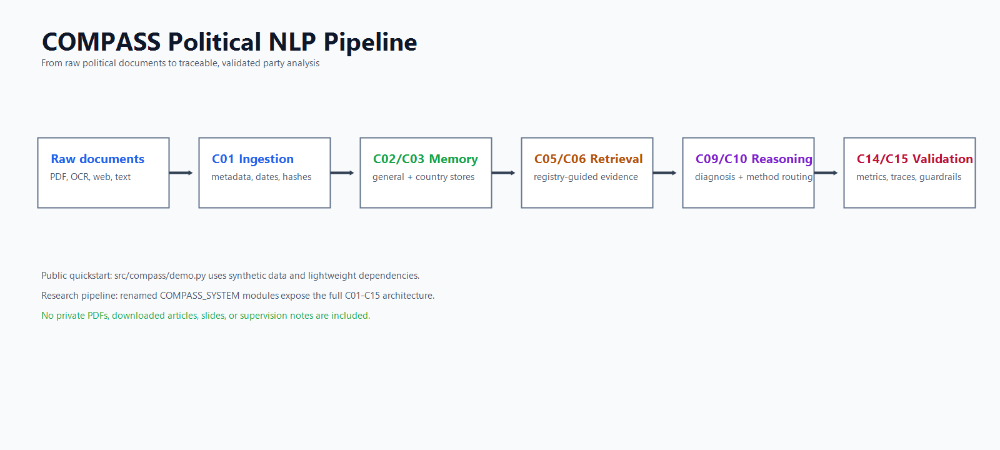

# COMPASS Political NLP


Research-oriented NLP framework for extracting, structuring, and validating political positions from party manifestos and heterogeneous political documents.

COMPASS combines computational social science, multilingual NLP, document engineering, and political economy. The public repository is a clean showcase version: reusable code, concise documentation, synthetic examples, tests, and no private PDFs, articles, slides, supervision notes, or internal work files.

## Why COMPASS?

Political documents are often multilingual, heterogeneous, and unevenly digitized. Many approaches work best on clean manifesto text, which can bias analysis against parties or countries with weaker documentation infrastructures.

COMPASS is designed as an auditable pipeline that moves from raw political evidence to traceable party profiles and, eventually, comparative political-space analysis.

## Public Demo

```powershell
python -m venv .venv
.\.venv\Scripts\Activate.ps1
pip install -r requirements-demo.txt
python examples/run_demo.py
pip install -r requirements-test.txt
python -m pytest
```

Expected output:

```text
Document loaded: sample_manifesto.txt
Detected political themes: economy, sovereignty, democracy
Generated party profile: examples/sample_party_profile.json
Validation status: passed
```

For a run aligned with the real architecture, start with:

```powershell
python examples/run_real_architecture.py smoke
```

Then, on an environment with the full dependencies and model-download access:

```powershell
pip install -r requirements-full.txt
python examples/run_real_architecture.py full --reset
```

See `docs/09_onyxia_runbook.md` for the Onyxia step-by-step guide.
See `docs/11_onyxia_hf_models.md` for local Hugging Face model serving with vLLM.

## Research Pipeline

```text
Raw political documents
-> ingestion
-> preprocessing
-> taxonomy annotation
-> retrieval / reasoning
-> validation
-> final political analysis
```

<p align="center">
  
</p>

## Repository Structure

```text
compass-political-nlp/
|-- README.md
|-- LICENSE
|-- .gitignore
|-- requirements-demo.txt
|-- requirements-test.txt
|-- requirements-full.txt
|-- pyproject.toml
|-- docs/
|-- scripts/
|-- src/
|   `-- compass/
|-- examples/
|-- notebooks/
|-- tests/
`-- assets/
```

## Source Code Philosophy

The `src/compass` package is extracted from the original `compass_system` research code, with public names replacing the internal `c01`, `c02`, ... component labels:

- `document_pipeline.py` keeps the C01 ingestion logic;
- `general_memory.py`, `political_graph.py`, and `country_memory.py` keep the C02/C02b/C03 memory split;
- `internal_retrieval.py` supports registry-guided retrieval with optional HyDE and parent-child context enrichment;
- `vparty_registry.py`, `diagnostic_engine.py`, `reasoning_engine.py`, `judge_panel.py`, `aggregation.py`, `final_output.py`, `validation.py`, and `guardrails.py` preserve the downstream architecture;
- `schemas.py` remains the interface contract between components.

The deterministic demo is intentionally isolated in `compass.demo`. It is a zero-credential quickstart, not a replacement for the research pipeline.

## Current Scope

The public version currently includes:

- renamed research modules extracted from `compass_system`;
- the V-Party registry YAML examples;
- parent-child chunking, optional HyDE retrieval, and a political knowledge graph component;
- architecture and component-choice documentation;
- a deterministic synthetic demo pipeline for quick verification;
- tests for the public demo.

The full research pipeline depends on OCR, PDF parsing, embeddings, reranking, NLI, LLM-assisted coding, and human validation. The quick demo avoids those heavy dependencies so the repository can still be checked immediately.

## Data Policy

This repository does not include copyrighted manifestos, restricted datasets, confidential research notes, private supervision material, downloaded articles, or internal Claude work files.

Public examples are synthetic.

## Disclaimer

COMPASS is an academic research project. Political scores or profiles produced by the pipeline require human review, robustness checks, and external validation before substantive interpretation.

## Author

Inza Ouada Soro  
ENSAE Paris  
Research internship project in NLP, political economy, and computational social science.
